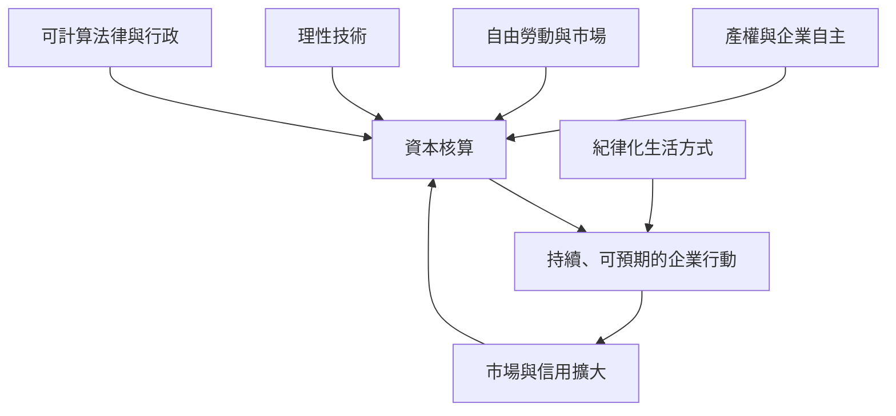

# 韋伯式經濟史分析方法

**系列：** 00_教學大綱總覽  
**上一章：** 01_全書核心命題與閱讀限制 ｜ **下一章：** 03_第一篇_農業組織與權利分化

## 八步分析程序

### 1. 先界定要解釋的制度結果

不要問抽象的「有沒有資本主義」，而要問：日常需求是否主要由持續企業與資本核算供給？若移除這套供給方式，體系是否仍能運作？（PDF pp. 284–285）

### 2. 把制度拆成可比較維度

| 維度 | 診斷問題 |
|---|---|
| 生產手段 | 土地、原料、工具、場所與固定資本由誰占有？ |
| 勞動 | 家計、奴隸、農奴、佃戶、獨立工匠或自由工人？ |
| 產品與市場 | 誰擁有產品？誰能接近市場與顧客？ |
| 核算 | 成本、收益、期初與期末資本能否用貨幣比較？ |
| 法律與行政 | 權利、契約與裁判是否相對可預計？ |
| 組織邊界 | 家計與企業是否分離？責任由誰承擔？ |
| 動機 | 行動者追求最大利潤、身分生活、生存保障或宗教義務？ |

### 3. 建立並列類型，不先假定單線階段

`[文本推導]` 本書常以 oikos、村落依附工匠、定作、包工制、行會、工場、工廠、commenda 等作比較標尺，但沒有正式講授「理念類型」的認識論。不同形式可以並存、混合或沿不同路徑轉化（PDF pp. 128–148）。

### 4. 重建行動者的利益與生活取向

領主可能追求消費、政治支配或出口收入；行會師傅追求傳統生活標準；商人追求遠距套利與信用；宗教信徒追求有秩序的得救生活。不能把所有人預設為同一種跨歷史的利潤最大化者。

`[文本推導]` 但「別預設利潤最大化」不能只是告誡。**面對書中沒有的新案例時，用這四個可查訊號判斷取向**（都改寫自本書自己的案例，非現代發明）：

| 訊號 | 要問的問題 | 本書的原型 |
|---|---|---|
| **收入停止點** | 收入到某水準後就停止追加投入，還是無上限？ | 傳統主義：工資加倍則工時減半（ch 30） |
| **剩餘的去向** | 盈餘進再生產、身分性消費，還是宗教／公共義務？ | 領主消費 vs 企業再投資（ch 4、6） |
| **風險承擔者** | 虧損由誰吸收？——決定他**是否非做事前核算不可** | 行會集體保障 vs 商人自負盈虧（ch 9、17） |
| **退出成本** | 改行或改變作法要付出什麼身分／社群代價？ | 行會封閉、種姓、氏族義務（ch 8、9） |

四格都指向「收入有上限、剩餘不進再生產、風險被集體吸收、退出代價高」時，該行動者就不是利潤最大化者，**用報酬率去預測他的行為會系統性失準**。

### 5. 用對照案例隔離條件

- 西、東歐面對市場擴張，形成不同農業制度（PDF pp. 102–104）。
- 棉花技術在英國配合自由勞動，在美國卻強化奴隸制（PDF p. 97）。
- 人口增長在中國與歐洲沒有產生相同結果（PDF p. 361）。
- 貴金屬流入印度、西班牙與西歐的後果不同（PDF pp. 361–363）。

對照的作用不是證明單一原因，而是排除「只要 X 就必然 Y」。

### 6. 區分因果角色

| 角色 | 問法 |
|---|---|
| 必要前提 | 沒有它，結果是否不可能？ |
| 促進條件 | 它是否提高結果的機會？ |
| 傳導機制 | 它如何改變行動者選項或報酬？ |
| 阻礙 | 它如何封鎖核算、市場或自由移動？ |
| 可利用機會 | 哪些群體能把新條件轉為自身利益？ |
| 非預期後果 | 行動原意與制度結果是否不同？ |

> [!warning] `[跨著作補充]` adequate cause 不是本書用語
> **全書 OCR 查無 `adequate cause`／`ideal type`／`Verstehen` 任何一詞**。適當因果（adäquate Verursachung）出自韋伯 1906 年〈歷史解釋中的客觀可能性與適當因果〉，不在本書。
> 它**不可譯作「充分原因」**：其意為「顯著提高結果的客觀可能性」，而非充分條件——韋伯正是用它來拒絕決定論式因果。
> 本書只在**做法上**符合這種因果觀（見上表與第 5 步的對照案例），從未把它講出來。引用時必須標成跨著作補充，不能寫成本書主張。

### 7. 建立合取與回饋鏈



現代資本主義是條件彼此配合與回饋的結果，不是把「技術＋法律＋宗教」列成彼此獨立的加法清單。

### 8. 做來源審計

每個結論都歸入：

1. 本書直接陳述；
2. 可由本書案例推導；
3. 韋伯其他著作補充；
4. 當代作者應用；
5. 尚待現代史學驗證。

## 與其他方法的關係

- [[問題分析方法論 Problem Analysis Methodology/03_MECE_Issue_Tree|MECE／Issue Tree]]：協助拆制度維度，但歷史條件常互相作用，不宜假裝完全獨立。
- [[問題分析方法論 Problem Analysis Methodology/09_Steelman_Red_Team|Steelman＋Red Team]]：先保留原解釋最強形式，再找反例與概念錯置。
- [[問題分析方法論 Problem Analysis Methodology/12_Popper_Falsifiability|Popper 可否證性]]：用跨案例對照提出可能推翻單因解釋的觀察。
- [[問題分析方法論 Problem Analysis Methodology/23_Weber_Institutional_Economic_Analysis|既有制度分析筆記]]：提供當代操作化；本筆記提供逐頁文本邊界。

## 一頁式模板

```text
要解釋的制度結果：
時空範圍：
占有結構：
勞動形式：
市場接近與產品控制：
技術／固定資本：
法律與行政可預計性：
家計／企業邊界與核算：
行動者利益與生活取向：
對照案例：
因果角色：
反例與替代解釋：
來源層級：
```

## 來源

- 第二篇 OCR，PDF pp. 128–148。
- 第四篇 OCR，PDF pp. 284–287、321–323、361–365。

